<h1 align="center">Hi 👋, I'm Huấn Cánh Cụt 🐧</h1>

    

    
 

        
    

- 🐧 My name is Cao Trong Huan, I'm from **Hung Yen, VietNam**.
- 🌱 I’m currently learning **ExpressJS, TailwindCss** and **NextJS**.
- 👨‍💻 All of my projects are available at [https://github.com/HuanCanhCut](https://github.com/HuanCanhCut).
- 💬 Ask me about **ReactJS**.
      

 
 

<h3 align="left">Languages and Tools:</h3>
<table align="center">
  <tr>
    <td></td>
    <td></td>
    <td></td>
    <td></td>
    <td></td>
    <td></td>
    <td></td>
    <td></td>
  </tr>
    <td></td>
    <td></td>
    <td></td>
    <td></td>
    <td></td>
    <td></td>
    <td></td>
    <td></td>
  </tr>
</table>

 

  
  

 

 
 

  <picture>
  <source
    media="(prefers-color-scheme: dark)"
    srcset="./images/breakout-dark.svg"
  />
  <source
    media="(prefers-color-scheme: light)"
    srcset="./images/breakout-light.svg"
  />
  
</picture>

  <i>Let's connect and chat! Open to anything under the sun.</i>
  

      <code></code>
      <code></code>
  

  

